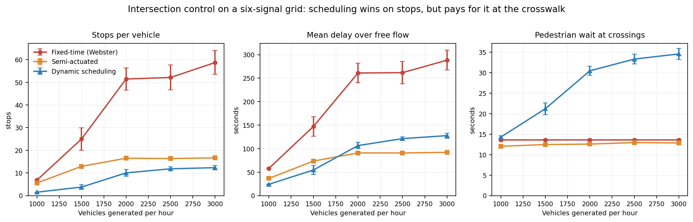
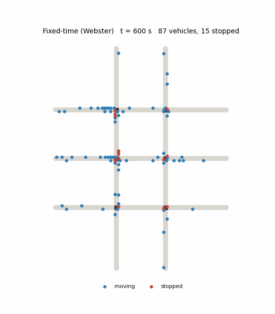
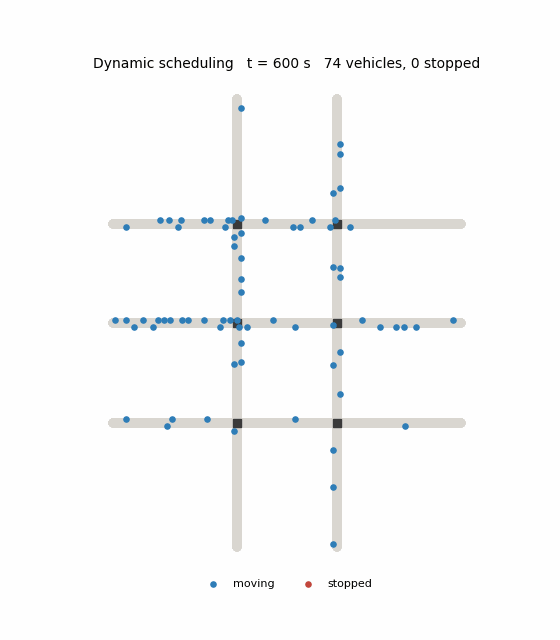

# Intersection Control: Signals vs. Scheduling

A microsimulation study of three ways to run a six-signal urban grid, and a
measurement of what the futuristic option actually costs the people on foot.

[](https://colab.research.google.com/github/ruud0/intersection-control-sim/blob/main/notebooks/demo.ipynb)

**[Run the simulation in your browser](https://colab.research.google.com/github/ruud0/intersection-control-sim/blob/main/notebooks/demo.ipynb)**, no install needed. The
notebook runs a reduced sweep, regenerates the figures below from your own run,
and renders the grid animating under whichever controller you pick. ~5 minutes.



## The result

Reservation-based scheduling cuts **stops per vehicle by 4.5–5.1×** against a
Webster-timed fixed signal, across every demand level tested. That part holds up.

Two things complicate it, and both are the point of the study:

**The delay advantage inverts under load.** Below roughly 1,800 vehicles/hour
scheduling has the lowest delay of the three. Above it, semi-actuated signals
take over and stay ahead: 90.9 s vs 106.5 s at 2,000 veh/h, 92.1 s vs 127.7 s
at 3,000.

**Scheduling pays for its smoothness at the crosswalk.** Mean pedestrian wait
under scheduling climbs from 14.3 s to 34.6 s as demand rises, a 2.4× increase,
while both signal strategies hold flat near 13 s. Continuous vehicle flow means
there is never a natural gap to release a pedestrian into, so the crossing has
to be forced, and under load it gets forced late.

| Strategy | Stops/veh | Mean delay | p95 delay | Ped wait |
|---|---|---|---|---|
| Fixed-time (Webster) | 51.47 | 261.0 s | 875.9 s | 13.6 s |
| Semi-actuated | 16.50 | 90.9 s | 289.2 s | 12.6 s |
| Dynamic scheduling | **10.04** | 106.5 s | **259.2 s** | 30.5 s |

*At 2,000 veh/h, averaged over 8 seeds.*

The honest summary: scheduling is the best way to keep traffic *moving*,
semi-actuated signals are the best way to keep it *fast* once the network is
busy, and neither of those is the same question as whether a pedestrian can get
across the street.

## Why I built it

This reimplements and extends an IE 496 undergraduate research project (Penn
State) that compared the same three strategies in SUMO. That study found the
three strategies clearing traffic in essentially the same time (a 1.9% spread)
and concluded the difference was qualitative.

I thought the null result was an artifact of the experiment rather than a fact
about traffic control, for three reasons: demand was uniform (thirteen identical
flows), each configuration was run once, and pedestrians were not modeled at
all. So I rebuilt it with uneven demand, seed replication, and pedestrians as
first-class agents. The difference between strategies turns out to be large; it
just does not show up in clearing time.

## Method

A time-stepped microsimulation, written from scratch in Python with no
simulation dependencies.

**Network.** Six signalised intersections on a 2×3 grid: two north-south
avenues crossing three east-west streets, 16 nodes and 17 street segments. The
geometry mirrors the original SUMO network.

**Driving.** The Krauss car-following model, the same model SUMO uses by
default. Drivers take the fastest speed from which they can still stop safely,
minus a random dawdling term, which reproduces platoon formation and stop-and-go
waves rather than assuming them.

**Demand.** Poisson arrivals over a weighted origin-destination matrix. The
east-west streets act as an arterial, the peak direction is loaded more heavily
than the counter-peak, and the arrival rate follows a smooth peak so every run
covers under-saturated, saturated, and recovering conditions. 8% trucks, with
their own length and acceleration.

**Pedestrians.** Poisson arrivals at each crossing, with MUTCD timing: a 4 s
WALK interval plus a clearance interval computed at the 3.5 ft/s design walking
speed, giving a ~15.2 s minimum green wherever pedestrians are served.

**The three controllers**

- *Fixed-time* uses **Webster's formula** to set cycle length from the critical
  flow ratios, with green split in proportion, the textbook OR method, so the
  baseline is a fair opponent rather than an arbitrary cycle.
- *Semi-actuated* rests the arterial in green and serves the side street on
  detector or push-button call, with unit extension, gap-out, and max-out.
- *Dynamic scheduling* removes phases entirely. Each intersection keeps a ledger
  of committed time intervals; every vehicle inside a 160 m horizon books the
  earliest slot it can physically reach and receives a speed advisory that lands
  it there. Pedestrians book the crossing too, and pre-empt vehicle bookings
  once they have waited past the limit.

**Validation.** Intersection occupancy is enforced physically for every
strategy, independent of the controller, so no strategy can claim a movement the
geometry would not allow. The signal strategies trigger this check zero times,
as they should. Scheduling triggers it 709–4,614 times per run, which is a real
finding: the reservation ledger alone is *not* sufficient to guarantee
separation once vehicles miss their slots, and a deployable system would need
the physical interlock underneath it.

## Reproduce it

```sh
git clone https://github.com/ruud0/intersection-control-sim.git
cd intersection-control-sim
pip install -r requirements.txt

python run.py            # 120 runs: 3 controllers x 5 demand levels x 8 seeds (~5 min)
python analyze.py        # writes docs/headline.png and prints the results table
```

Faster check:

```sh
python run.py --quick    # 12 runs, ~20 seconds
python analyze.py
```

Watch a single strategy run:

```sh
python animate.py --controller scheduler --out docs/simulation.gif
python animate.py --controller fixed     --out docs/simulation_fixed.gif
```

<p align="center">
  
  
</p>

Fixed-time on the left, scheduling on the right. Red dots are stopped vehicles.

## Data

There is no external dataset. All demand is generated from the seeded
origin-destination model in `src/demand.py`, so every figure in this README
regenerates exactly from the commands above. `results/results.csv` holds one row
per run: 120 rows, 241,938 vehicles simulated, every vehicle completing its
route in every run.

## Layout

```
run.py            experiment sweep across controllers, demand levels, seeds
analyze.py        figures and summary table
animate.py        GIF of a single run
src/network.py    grid geometry, routing
src/demand.py     OD matrix, Poisson arrivals, pedestrians
src/vehicle.py    Krauss car-following
src/sim.py        simulation loop, intersection occupancy enforcement
src/metrics.py    performance measures
src/controllers/  fixed_time.py, semi_actuated.py, scheduler.py
```

## Limitations

Stated plainly, because they bound what the numbers mean:

- Two-phase signals, one lane per direction, and conflicts resolved at the level
  of movement axis rather than individual turning paths. Permitted left turns
  against opposing traffic are not modeled.
- The scheduler assumes perfect compliance, perfect sensing, and no
  communication latency. Those assumptions are why the pedestrian result matters
  more than the vehicle result; the vehicle numbers are an upper bound on what
  scheduling could deliver, and it still loses on delay under load.
- Pedestrian pre-emption caps the *mean* wait but not the tail: p95 pedestrian
  wait under scheduling reaches 121.6 s at the highest demand. That is a defect
  in the controller, not a property of scheduling in general, and it is the
  first thing I would fix.
- Calibrated against textbook parameters (1,900 veh/h/lane saturation flow,
  MUTCD walk timing), not against field counts from a real corridor.

## Provenance

This is a **reimplementation**, written from scratch. It builds on an IE 496
undergraduate research project at Penn State, Fall 2025, which compared the same
three control strategies in SUMO.

The original SUMO network, route files, and TraCI controller are not included
here. All code in this repository is new, and every result reported above comes
from this implementation, not from the original study.
